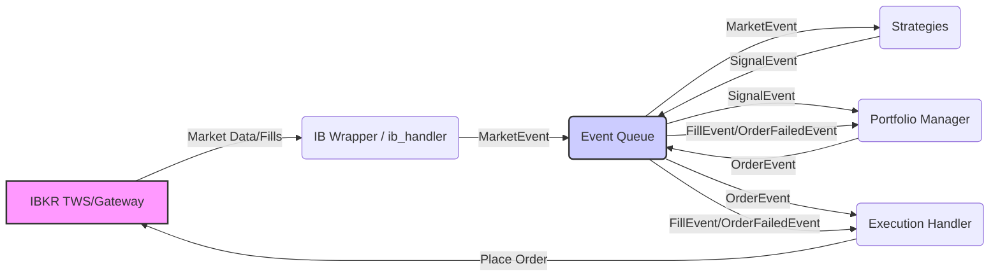

# Equity Trading System (using IBKR TWS API)


## Overview

This project implements a modular, event-driven algorithmic trading system in Python designed to connect to the Interactive Brokers (IBKR) Trader Workstation (TWS) or IB Gateway. It utilizes the official `ibapi` library to interact with IBKR for market data retrieval, order execution, and account monitoring, providing a robust framework for developing, backtesting, and deploying automated equity trading strategies.

The system is built with a focus on clarity, modularity, and resilience, incorporating features for live trading, backtesting, performance tracking, risk management, and configuration flexibility.

## Key Features

* **Event-Driven Architecture:** Core logic revolves around a central event queue (`queue.Queue`), decoupling components like data handling, strategy execution, portfolio management, and order execution for better modularity and testability.
* **IBKR TWS API Integration:** Connects securely to TWS or IB Gateway using the official `ibapi` library via a robust wrapper (`core/ib_wrapper.py`).
* **Asynchronous Startup & Synchronization:** Handles initial connection, contract qualification for specified symbols, and synchronization of account/position state before trading begins. Includes parallel loading of initial historical data.
* **Live Data Handling:** Subscribes to and processes 5-second real-time bars from IBKR. Manages contract details and symbol qualification.
* **Live Portfolio Management:** Tracks real-time holdings, average costs, settled/total cash, Net Liquidation Value, and unrealized P&L based on IBKR account updates. Includes T+N settlement logic for cash management.
* **Risk Management:**
    * Calculates and applies ATR-based stop-losses (`strategy/base.py`).
    * Implements risk-per-trade position sizing based on settled cash and stop distance.
    * Monitors portfolio-level risk: Max Active Positions, Max Daily Loss %, Max Drawdown %.
    * Includes (configurable) volatility monitoring (e.g., using VIX) to potentially pause entries or adjust risk.
    * Includes (configurable) sector allocation limits and gross exposure ratio limits.
    * Includes (configurable) rapid loss detection based on portfolio value changes.
* **Order Execution:**
    * Translates strategy signals (`SignalEvent`) into executable orders (`OrderEvent`).
    * Places Market (`MKT`), Limit (`LMT`), and Trailing Stop (`TRAIL`) orders via the TWS API.
    * Supports basic **Bracket Orders** (Entry + Stop-Loss + Take-Profit) via IBKR's parent/child order mechanism.
    * Includes API rate limiting and basic Order Efficiency Ratio (OER) monitoring.
* **Strategy Framework:**
    * Provides a `BaseStrategy` class for common functionality (data storage, position tracking, ATR stop calculation).
    * Includes example strategies:
        * `MovingAverageCrossoverStrategy` (Momentum)
        * `RsiMeanReversionStrategy` (Mean Reversion)
    * Signals (`SignalEvent`) include ATR values to facilitate volatility-adjusted position sizing.
* **Performance Tracking:**
    * Records detailed equity curve and daily snapshots.
    * Logs individual trade executions and calculates P&L.
    * Computes standard performance metrics: CAGR, Sharpe Ratio, Sortino Ratio, Max Drawdown, Calmar Ratio, Win Rate, Profit Factor, etc.
    * Optionally calculates Alpha and Beta against a benchmark symbol (e.g., `SPY`) using `scipy`.
    * Saves performance reports and trade logs to CSV files.
* **Backtesting Module:**
    * Simulates the trading environment using historical OHLCV data from CSV files.
    * Includes `SimulatedExecutionHandler` with configurable slippage and commission.
    * Includes `BacktestPortfolio` simulating cash settlement and risk rules.
    * Supports basic **Walk-Forward Analysis** for parameter optimization and overfitting checks (`backtest/main_loop.py`).
* **Configuration:** Centralized configuration via `config.yaml` for IBKR connection, account details, trading parameters, strategy settings, logging levels, backtest parameters, and system behavior.
* **Logging:** Robust logging to both console and rotating files (`logs/`) using Python's standard `logging` module.

## Architecture

The system follows a standard event-driven pattern:

1.  **Data Handler (`data/ib_handler.py`)**: Connects to IBKR, qualifies contracts, subscribes to market data, and generates `MarketEvent`s. Also handles historical data requests.
2.  **Event Queue (`core/event_queue.py`)**: A central `queue.Queue` used for inter-component communication.
3.  **Strategy (`strategy/`)**: Consumes `MarketEvent`s, applies trading logic (e.g., MA Crossover, RSI), and generates `SignalEvent`s (including direction, stop price, ATR).
4.  **Portfolio Manager (`portfolio/live_manager.py`)**: Consumes `SignalEvent`s, checks risk limits (position size, drawdown, daily loss, sector limits, etc.), calculates order quantity based on risk parameters and settled cash, and generates `OrderEvent`s. Also consumes `FillEvent`s to update internal state (holdings, cash, P&L).
5.  **Execution Handler (`execution/ib_executor.py`)**: Consumes `OrderEvent`s, translates them into IBKR API calls (`placeOrder`), manages order IDs, handles bracket order submission, monitors OER, and receives execution confirmations from IBKR (generating `FillEvent`s or `OrderFailedEvent`s).
6.  **Main Loop (`main.py`)**: Orchestrates the system startup, manages the event loop, dispatches events to the appropriate components, and handles shutdown.



## Project Structure

```text
equity_trading_system/
├── core/                 # Core components (event queue, events, IB API wrapper)
│   ├── event_queue.py
│   ├── events.py
│   └── ib_wrapper.py
├── data/                 # Data handling (live connection, historical data loading)
│   └── ib_handler.py
├── strategy/             # Trading strategy logic
│   ├── base.py
│   ├── momentum.py
│   └── mean_reversion.py
├── portfolio/            # Portfolio management (state, risk, order generation)
│   └── live_manager.py
├── execution/            # Order execution handling
│   └── ib_executor.py
├── performance/          # Performance tracking and metrics calculation
│   └── tracker.py
├── backtest/             # Backtesting components
│   ├── data.py
│   ├── execution.py
│   ├── main_loop.py
│   └── portfolio.py
├── utils/                # Utility functions (logging)
│   └── logger.py   
├── logs/                 # Directory for log files (created automatically)
├── results/              # Directory for performance results (created automatically)
├── config_loader.py      # Configuration loading
├── config.yaml           # Configuration file
├── main.py               # Main entry point for live trading
├── requirements.txt      # Environment dependencies
└── README.md             # This file
```

## Installation

**Prerequisites:**

1.  **Python:** Version 3.9 or higher recommended.
2.  **Interactive Brokers Account:** A live or paper trading account with IBKR.
3.  **TWS or IB Gateway:** Install either Trader Workstation or IB Gateway from the IBKR website. IB Gateway is recommended for automated systems due to lower resource usage and longer session times. Ensure it is running and you are logged in.
4.  **TA-Lib:** This library is required for technical indicators. Installation can be tricky. Follow the instructions specific to your operating system (often requires installing the underlying C library first): [TA-Lib Python Documentation](https://github.com/TA-Lib/ta-lib-python) (Note: You might need to find the specific installation guide for your OS).

**Steps:**

1.  **Install IB API:**

    * Download the 'TWS API' software from the [IBKR Website](https://interactivebrokers.github.io). Choose the 'Latest' version.
    * Run the installer.
    * Navigate to the installation directory (e.g., `~/IBJts/source` on macOS/Linux or `C:\TWS API` on Windows).
    * Go into the `pythonclient/ibapi` subdirectory (the exact path might vary slightly depending on the version).
    * Open a terminal or command prompt in that directory (the one containing `setup.py`) and run:
    ```bash
    python setup.py install
    ```
    * This installs the `ibapi` package into your Python environment.

2.  **Clone the Repository** (if applicable):

    ```bash
    git clone <repository_url>
    cd equity_trading_system
    ```

3.  **Create a Virtual Environment** (Recommended):

    ```bash
    python -m venv venv
    # On macOS/Linux:
    source venv/bin/activate
    # On Windows:
    # venv\Scripts\activate
    ```

4.  **Install Python Dependencies:**

    ```bash
    pip install -r requirements.txt
    ```

    This will install packages like `pandas`, `numpy`, `pyyaml`, `scipy`, etc. Ensure TA-Lib was installed successfully in the prerequisites step.

## Configuration

The system's behavior is primarily controlled by the `config.yaml` file.

  * **`ibkr`**: Connection details (host, ports, clientId), your IBKR `account_id` (*important: update this!*), historical data request limits.
  * **`account`**: Initial capital simulation setting, settlement days.
  * **`trading`**: Symbols to trade, risk parameters (risk per trade, max positions, loss limits), ATR stop settings, sector map, leverage/exposure limits.
  * **`strategies`**: Enable/disable specific strategies and configure their parameters (e.g., moving average windows, RSI thresholds).
  * **`logging`**: Log level (`INFO`, `DEBUG`, etc.) and log directory.
  * **`performance`**: Risk-free rate for calculations.
  * **`benchmarking`**: Benchmark symbol (e.g., `SPY`) and whether to calculate Alpha/Beta.
  * **`monitoring`**: Check intervals for connection/risk, OER settings.
  * **`backtest`**: Settings for the backtesting module (data directory, dates, strategy choice, simulation parameters).
  * **`system`**: System-level behavior flags (e.g., `allow_partial_hist_data`).

**IMPORTANT:** Before running, carefully review and edit `config.yaml`, especially the `ibkr` section (`account_id`, `ports`) and the `trading` section.

## Usage

1.  **Setup IB Gateway / TWS:**

    * Launch IB Gateway or TWS.
    * Log in to your Paper Trading account (recommended for testing) or Live account.
    * Go to `File` -\> `Global Configuration` -\> `API` -\> `Settings`.
    * Ensure **"Enable ActiveX and Socket Clients"** is checked.
    * Note the **Socket port** (e.g., `7497` for Paper TWS/Gateway, `7496` for Live). Make sure this matches `config.yaml`.
    * Under **Trusted IPs**, add `127.0.0.1` if running the script on the same machine, or configure appropriately if running remotely.
    * Consider adjusting the **Read-Only API** setting for safety during initial tests.

2.  **Running Live Trading:**

    * Ensure IB Gateway/TWS is running and configured as above.
    * Activate your virtual environment (if used).
    * Run the main script from the project's root directory:
    ```bash
    python main.py
    ```
    * The system will connect, perform initial synchronization (contract qualification, account state, historical data), subscribe to live data, and start processing market events and generating trades based on the enabled strategies and configuration.
    * Monitor the console output and log files in the `logs/` directory.
    * Press `Ctrl+C` to initiate a graceful shutdown.

3.  **Running Backtesting:**

    * Ensure you have historical data CSV files (named `SYMBOL.csv`, e.g., `AAPL.csv`) in the directory specified in `config.yaml` (`backtest` -\> `csv_directory`). The CSVs should contain columns like `date`, `open`, `high`, `low`, `close`, `volume`.
    * Configure the desired backtest settings in `config.yaml` (start/end dates, strategy, commission, slippage, etc.).
    * If running walk-forward analysis, configure the `walk_forward` section under `backtest`.
    * Run the backtest script:
    ```bash
    python backtest/main_loop.py
    ```
    * The backtester will simulate the event loop using the historical data. Performance metrics and trade logs will be saved to the directory specified in `config.yaml` (`backtest` -\> `results_directory`).

## Backtesting & Optimization

The system includes a backtesting engine (`backtest/`) that simulates the event-driven flow using historical CSV data.

  * It simulates realistic execution with configurable commission and slippage.
  * The `backtest/main_loop.py` script can run single backtests or perform **Walk-Forward Analysis (WFA)** if enabled in `config.yaml`.
  * WFA helps optimize strategy parameters over rolling in-sample periods and tests them on subsequent out-of-sample periods, reducing the risk of overfitting.

## Risk Management & Fail-Safes

The system incorporates several layers of risk management:

  * **Trade Level:** ATR-based stop-losses are calculated and intended to be placed with entry orders (via bracket orders).
  * **Position Sizing:** Risk-per-trade and volatility-adjusted sizing limits exposure per trade.
  * **Portfolio Level:** Configurable limits on max active positions, max daily loss percentage, and max overall drawdown percentage trigger trading halts. Sector allocation and gross exposure limits are also checked.
  * **Volatility Monitoring:** Option to pause new entries or adjust risk during high-volatility periods (e.g., based on VIX).
  * **System Level:** Includes basic rate limiting for orders, OER monitoring, connection monitoring with reconnect attempts, and graceful shutdown handling.

## Dependencies

Key Python libraries used:

  * `ibapi`: Official Interactive Brokers TWS API (Requires manual installation from IBKR)
  * `pandas`: Data manipulation and analysis.
  * `numpy`: Numerical operations.
  * `PyYAML`: For loading `config.yaml`.
  * `TA-Lib`: Technical analysis indicators (Requires separate installation of the C library).
  * `scipy`: Optional, used for Alpha/Beta calculation in performance tracking.

See `requirements.txt` for a full list of Python package dependencies.

## License

Proprietary.

## Disclaimer

> This software is for educational and informational purposes ONLY. Trading financial instruments involves substantial risk of loss and is not suitable for all investors. Past performance is not indicative of future results.
>
> The authors and contributors provide this software *as is* without warranty of any kind, express or implied. They are not responsible for any trading losses incurred using this software or based on its output.
>
> Always conduct thorough backtesting and simulation in a Paper Trading account before considering any live deployment with real capital. This software does not constitute financial, investment, or trading advice. Consult with a qualified financial professional before making any investment decisions. Use this software entirely at your own risk.
